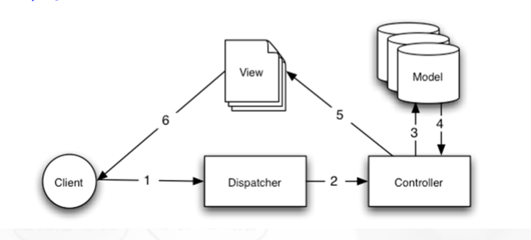
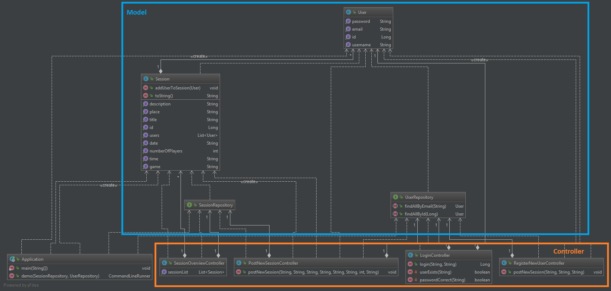
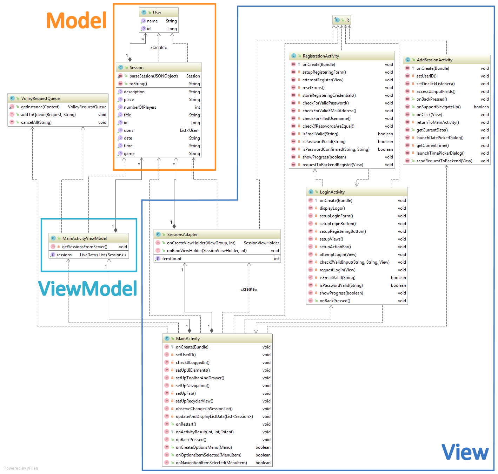

# Software Architecture Document

# Table of Contents
- [Introduction](#1-introduction)
    - [Purpose](#11-purpose)
    - [Scope](#12-scope)
    - [Definitions, Acronyms and Abbreviations](#13-definitions-acronyms-and-abbreviations)
    - [References](#14-references)
    - [Overview](#15-overview)
- [Architectural Representation](#2-architectural-representation)
- [Architectural Goals and Constraints](#3-architectural-goals-and-constraints)
- [Use-Case View](#4-use-case-view)
    - [Use-Case Realizations](#41-use-case-realizations)
- [Logical View](#5-logical-view)
    - [Overview](#51-overview)
    - [Architecturally Significant Design Packages](#52-architecturally-significant-design-packages)
- [Process View](#6-process-view)
- [Deployment View](#7-deployment-view)
- [Implementation View](#8-implementation-view)
    - [Overview](#81-overview)
    - [Layers](#82-layers)
- [Data View](#9-data-view)
- [Size and Performance](#10-size-and-performance)
- [Quality](#11-quality)

## 1. Introduction

### 1.1 Purpose
This document provides an overview of our software architecture. With several different architectural views it depicts different aspects of the system. It is intended to capture and convey the significant architectural decisions which have been made for the system.

### 1.2 Scope
This document describes the architecture of the CommonPlayground project.

### 1.3 Definitions, Acronyms and Abbreviations

| Abbrevation | Description                            |
| ----------- | -------------------------------------- |
| API         | Application programming interface      |
| MVC         | Model view controller                  |
| REST        | Representational state transfer        |
| SDK         | Software development kit               |
| SRS         | Software requirements specification    |
| UC          | Use case                               |
| VCS         | Version control system                 |
| n/a         | not applicable                         |
| tbd         | to be determined                       |

### 1.4 References

| Title                                                              | Date       | Publishing organization   |
| -------------------------------------------------------------------|:----------:| ------------------------- |
| [CommonPlayground Blog](https://commonplayground.wordpress.com/)   | 2018-10-09 | CommonPlayground Team     |
| [Repository on GitHub](https://github.com/nilskre/CommonPlayground)| 2018-10-09 | CommonPlayground Team     |
| [UC1 Posting a session](./use_cases/UC1_Post_Session.md)           | 2018-11-04 | CommonPlayground Team     |
| [UC2 Joining a session](./use_cases/UC2_Join_Session.md)           | 2018-10-28 | CommonPlayground Team     |
| [UC3 Getting an overview](./use_cases/UC3_Session_Overview.md)     | 2018-10-28 | CommonPlayground Team     |
| [UC4 Creating an account](./use_cases/UC4_Create_Account.md)       | 2018-11-04 | CommonPlayground Team     |
| [UC5 Logging in](./use_cases/UC5_Login.md)                         | 2018-11-12 | CommonPlayground Team     |
| [UC6 Logout](./use_cases/UC6_Logout.md)                            | 2018-11-12 | CommonPlayground Team     |
| [tbd Test plan](../tbd)                                            | tbd 2018-XX-XX | CommonPlayground Team     |
| [SRS](./SoftwareRequirementsSpecification.md)                      | tbd 2018-10-14 | CommonPlayground Team     |

### 1.5 Overview
This document contains the architectural representation, goals and constraints as well 
as the logical, deployment, implementation and data views.

## 2. Architectural Representation
This project uses the MVC Pattern for the front end (Android App) and for the back end (Spring). So the model (data model, domain specific classes), the view (user interface) and the controller (controls the Application) are separated. The MVC Pattern can be seen in the next picture:

https://www.techyourchance.com/wp-content/uploads/2015/06/MVC_MVP.png

The front end internally follows the MVVM pattern which can be depicted as following.
This pattern separates the View components again into a funcional part (the ViewModel) and a purely representational part (View) while the model remains analogous to the back end.

https://en.wikipedia.org/wiki/Model%E2%80%93view%E2%80%93viewmodel

## 3. Architectural Goals and Constraints

### MVC
As mentioned in chapter two frontend and backend are using the MVC pattern. This enables a clean software architecture with separate model view and controller.

### Front end
The Android App Client is written in Java. In the Frontend no MVC Tool is needed, because the MVC Pattern is integrated into Android development.
However, since the App only serves as as front end the MVC it serves as the V component to the overall application formed by front end and back end together.
For a clean view structure the frontend in itself uses the MVVM (Model View ViewModel) pattern.
MVVM:
* Model: domain specific classes modeled after backend classes
* View: activities
* ViewModel: specific functionalities and network operations

### Back end
The back end is also written in Java. As MVC tool we use Spring Boot. For the account system Spring security is used. As a database we use H2. 
The Server offers multiple REST APIs which are accessed by our front end. 
MVC: 
* Model: domain specific classes
* View: no view available
* Controller: RestController

## 4. Use-Case View

### 4.1 Use-Case Realizations
n/a

## 5. Logical View

### 5.1 Overview
The logical view for our application follows the Spring Boot architecture and looks like:
  
In our specific case the view however is not part of spring but provided separately as an android front end.
The android application handles all the user interaction and independently handles the view coordnation thus fulfilling the roles of view and dispatcher alike. However view and dispatcher do not interact with the client independently instead the dispatcher has been substituted by the ViewModel which connects the view and the model as describe above as well as forming the connection to the controller.
However the frontend does not interact with the model itself. Model classes are duplicated into the fronted for consistency reasons but are only used to populate the corresponding views.
Any actual manipulation of the model is handled by the backend.

### 5.2 Architecturally Significant Design Packages
On this section you can find our class diagrams for the front end and the back end. We have clearly marked which parts fulfill the model, the view and the controller tasks.

Here is the class diagram for the back end. As the backend has no view part we only highlighted the model and the controller parts.

Here is the class diagram for the front end. The Frontend consists of the view, the ViewModel, and duplicated domain specific classes from the back end (model).

## 6. Process View
n/a

## 7. Deployment View
Here you can see our deployement view diagram:

## 8. Implementation View
n/a
### 8.1 Overview
n/a
### 8.2 Layers
n/a

## 9. Data View
Database ER-Diagram:

## 10. Size and Performance
n/a

## 11. Quality/Metrics
tbd
