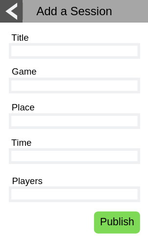

# Use-Case Specification: Posting a Session

# 1. Posting a Session

## 1.1 Brief Description
This use case allows users to post a session onto the session overview page. A session should include all important information that is necessary for other users. If a user wants to post a new session they need to fill in the template, which includes the fields:
- Name (short name for the session)
- Game (which game is the session for)
- Player maximum (Number of players which can still join this session including host)
- Place
- Time and Date
- Description

## 1.2 Mockup 

# 2. Flow of Events

## 2.1 Basic Flow
- Users klicks on "Post new session"-button
- "Post-Session"-template pops up
- User fills in template
- User klicks on "finish"-button
- Session gets posted

### Activity Diagram

### .feature File

[.feature File Posting a session](../../frontend/app/src/androidTest/assets/UC1_Post_Session.feature)
´´´ Cucumber
Feature: Use Case 1 Posting a Session
  As a USER
  I want to open the app and be able to post a new Session at the Session Overview Page
  Therefore I want the fields: title, description, game, place, date and numberOfPlayers able to be filled in

  Background:
    Given The user is logged in
    And Activity New Session is open

  @postsession-feature
  Scenario Outline: Add a new session
    When
    When The user types the title <title> and the input is correct
    And The user types the description <description> and the input is correct
    And The user types the game <game> and the input is correct
    And The user types the place <place> and the input is correct
    And The user types the date <date> and the input is correct
    And The user types the time <time> and the input is correct
    And The user types the number of players <numberOfPlayers> and the input is correct
    And The user presses the publish button
    Then A Request is sent
    And The posting screen is closed

    Examples: Sessions
      | title | description | game       | place       | date       | time  | numberOfPlayers |
      | Raid  | online Game | Game       | web         | 01.11.2018 | 12:00 | 10              |
      | Cards | fun         | Doppelkopf | Schlosspark | 29.10.2019 | 06:00 | 4               |

  @postsession-feature
  Scenario: Leaving the Activity New Session without sending a Request
    When The user presses the Back button
    Then No Request is sent
    And The posting screen is closed
´´´

## 2.2 Alternative Flows
n/a

# 3. Special Requirements
n/a

# 4. Preconditions
The preconditions for this use case are:
1. The user has started the App
2. The user has klicked on the "Post a session"-button

# 5. Postconditions
The postconditions for this use case are:
1. The session gets posted on the session overview page
2. The players participating index is incremented (session creator is the first person)

### 5.1 Save changes / Sync with server

If a session gets posted it needs to get synced with the server, so that every user can see the session.

# 6. Function Points
tbd
